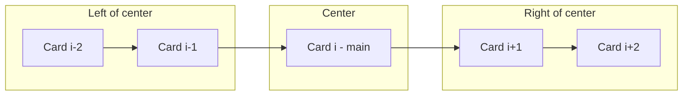

# iPhone-style App Switcher — Infinite center carousel

## Goal

A horizontal, overlapping card stack that mimics the iOS App Switcher and behaves as an **infinite carousel**:

- **Center-focused**: The active/main element is always in the **center of the screen**. Elements before it are on the **left**, elements after on the **right**.
- **Z-order**: The **centered element** has the **highest z-index** (on top). As cards get **further from center**, they get a **lower** z-index (further behind). Example: with cards 1, 2, 3, 4, 5 and **3** at center — 3 is on top; 2 and 4 are under 3 (same distance, same z-index); 1 is under 2, 5 is under 4; and so on for more cards.
- **Infinite loop**: As the user swipes left or right, elements move into the center then out the opposite side like a **rotating carousel** — no start/end; wrapping in both directions.
- **Children API**: Content is provided via **children** (each child = one card). **Drag-only** interaction (touch + mouse).

## Architecture

- **Location**: [src/components/app-switcher/](src/components/app-switcher/) (one folder = one self-contained component).
- **Dependencies**: Existing only — `motion` (Framer Motion) and React.

## Layout and infinite behavior

- **Position model**: Use a **continuous scroll offset** (e.g. a motion value `offsetX`). The “index” at center is derived from that offset (e.g. `centerIndex = round(offsetX / stepWidth)`). For **infinite** behavior, use a **virtual ring**: for each child index `i` (0..N-1), compute a “position” that can be any real number, then **wrap** into a fixed window around the current center (e.g. show only positions in `[center - 2, center + 2]`).
- **Rendering**: Normalize `children` to an array. For each child, compute its **logical position** in the carousel (can be fractional). Only render (or visibly place) cards that fall within a small window around the center to keep DOM and transforms bounded. As the user drags, the same logical items “rotate”: e.g. when the user drags left, the rightmost visible card moves to center, then to the left; when it goes past the left edge of the window, recycle it and render it on the right at `position = center + windowSize` (or use modulo logic so position is always in a range that maps to the same N items).
- **Center = main**: The card at center gets `scale = 1` and **highest z-index**. Cards further from center get smaller scale and **lower z-index by distance**: `zIndex = baseZ - distanceFromCenter` (e.g. `distanceFromCenter = Math.round(Math.abs(position - center))`), so the center is on top, then one step left/right (same z), then two steps (same z), etc.
- **Rotation feel**: Transitions are smooth (Framer Motion). When the drag updates the shared offset, all card positions update so that items appear to move toward center, then out the other side, giving a continuous rotating carousel feel.

## Implementation approach

1. **Children as cards**
  - Accept `children`; normalize to array with `React.Children.toArray(children)`.
  - Number of cards `N` is fixed. Infinite behavior is achieved by **position wrapping**, not by infinite DOM nodes.
2. **Single motion value and “center”**
  - One `useMotionValue(0)` for carousel offset (e.g. `dragOffset`). Dragging updates this (e.g. add delta x).
  - Define a “step” width (e.g. card width + gap). Current center index (float): `center = dragOffset / stepWidth`. Use modulo so that `center` maps to the same N cards: e.g. `centerIndex = ((center % N) + N) % N` for display, but keep **continuous** `center` for smooth animation (so we don’t snap the value, we only use modulo when deciding which child is at which logical position).
3. **Virtual window and per-card position (Option A)**
  - Use the **virtual ring** approach: render N cards, each with a **logical position** that can be any integer (e.g. … -1, 0, 1, 2, …). Map child `i` to positions `i`, `i + N`, `i - N`, etc. For a given `center`, choose for each `i` the representation that lies in the window `[center - W, center + W]` (e.g. W = 2). That gives each card a single `position`; render at `(position - center) * stepWidth` (so center is at 0). When `center` moves, positions stay continuous (no jump); when a card’s position leaves the window, reassign it to `position + N` or `position - N` so it appears on the other side.
4. **Transform per card**
  - For each card with logical `position` and current `center`:
    - `x = (position - center) * stepWidth` (horizontal offset from center of viewport).
    - `scale = 1 - k * Math.abs(position - center)` (e.g. k = 0.1) so center is 1, sides smaller.
    - `zIndex = baseZ - Math.round(Math.abs(position - center))` so stacking is by **distance from center**: center on top; then 2 and 4 (distance 1) behind 3; then 1 and 5 (distance 2) behind 2 and 4; etc.
  - Use `useTransform` from the single `dragOffset` motion value to derive each card’s `x`, `scale`, and `zIndex` so everything is driven by one gesture.
5. **Drag**
  - One draggable container (e.g. `motion.div` with `drag="x"`). On drag, update the shared offset (or bind `style={{ x: dragOffset }}` and use that as the source of truth; then derive “center” from it).  
  No clamping to finite bounds — allow continuous movement; the virtual ring (Option A) handles infinity.
6. **File structure**
  - Start with one file `AppSwitcher.tsx` (or split into `AppSwitcher.tsx` + `carouselLayout.ts` / `useInfiniteCarousel.ts` if the logic grows). Export `AppSwitcher` from the folder.
7. **Styling**
  - Container: fixed or max size, `overflow: hidden`, center the stack. Cards: absolute positioning, centered in the strip; `translateX` from layout math. `cursor: grab` / `grabbing` on the drag area.
8. **Demo**
  - In [src/App.tsx](src/App.tsx), render `<AppSwitcher>` with 3–5 placeholder cards to verify center focus, z-order (center on top, sides behind), and infinite rotation left/right.

## Summary

| Item        | Choice                                                                  |
| ----------- | ----------------------------------------------------------------------- |
| Layout      | Center = main; left/right behind (lower z-index)                        |
| Behavior    | Infinite rotating carousel (Option A: virtual ring / position wrapping) |
| API         | `AppSwitcher` with `children` (each child = one card)                   |
| Interaction | Drag-only horizontal                                                    |
| Location    | `src/components/app-switcher/`                                          |

No new dependencies. Implementation stays within Motion and React.